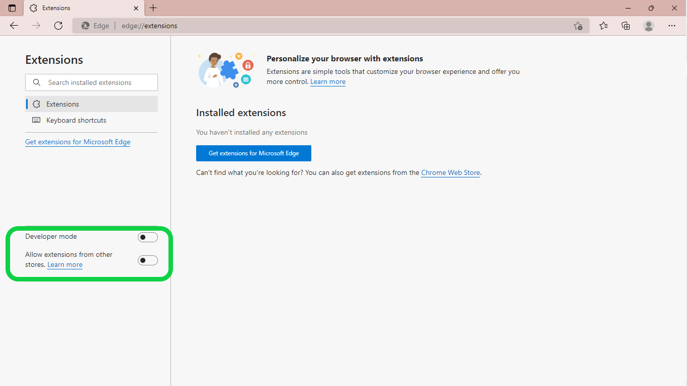

# Hi everyone,

This is a part of me learning [Web Dev For Beginners](https://github.com/microsoft/Web-Dev-For-Beginners) by Microsoft. All the materials that I used to create the extension (including the `images` folder) are provided by them.

## The Project

In this lesson, I learned on how to create an extension. Got an introduction about what is browser untill how to maintanance the web performance. It's my first time create an extension, so it's a exciting.

### The Obstacle

I got a problem while creating them. At first my extension didn't show at the browser and I was wondering why. Then I realized the why.

The picture shows that the toggles are off. In order to upload your extension, you need to turn on both toggles. I didn't realize this untill I saw the picture again from the lesson. I hope that they add the information about the toggles on how to install your extension. It will be helpful.

### The Results

I made it. The process was exciting. I gain some knowledge about the browser, an API, local storage, and web performance. There are some new terms (for me). It's definitely fun to learn.
